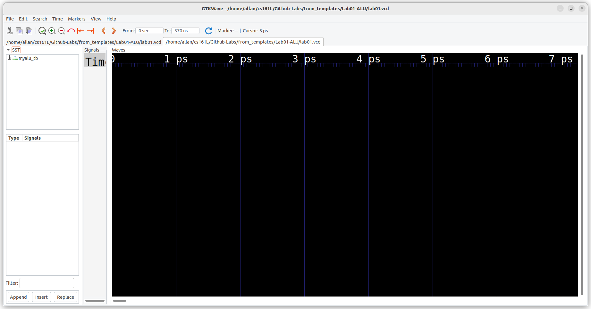
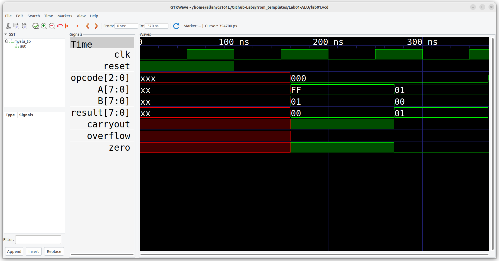

# Lab 1 - Arithmetic and Logic Unit (ALU)
 ## Introduction

Welcome to cs161L. This lab will be an introduction to microprocessors and the Verilog
language. You will also be getting familiar with the development environment. For the first few labs we sill use an open source tool
called Icaraus Verilog for sytnthesizing and simulating hardware, and GTKwave to view wave forms. These open source tools are available 
for Windows, Mac OS X (even for M1 macs), and Linux. You can also use these tools in a web browser (this means you can even usea chromebook
to do these first few assignments). This GitHub repository contains all the configuration file necessaryto run these tools inside of 
GitHub's Codespaces (but more about that later).

In later labs we will use the Xilinx design environment. You can findout more about this powerful hardware suite by following this [​Xilinx ISE Tutorial](https://docs.google.com/document/d/12RJBZ5fCQQC-67LlHlZTaUMVzfGAa97LAlWozz2Lt80/edit?usp=sharing)​. 

To begin learning about the Verilog Hardware Definition Language (HDL), I highly recommend these [tutorials](https://nandland.com/learn-verilog/) for learning Verilog in general. You may also use these additional Verilog examples [​here](http://www.asic-world.com/verilog/veritut.html)​ as a guide.

The goal of this lab is to implement a simple Arithmetic and Logic Unit (ALU) in Verilog.

ALUs are hardware circuits that perform the arithmetic computations within a processor. They
support multiple operations like addition, subtraction, multiplication, division, square roots, etc. The hardware logic to perform these operations can vary widely based on the approach used (Carry-Lookahead vs Ripple-Carry adder) or the data types supported (Integer, Float, Double). An ALU could even supply multiple versions of the same operation. They are not limited to only arithmetic operations. They can support bitwise operations, like AND OR and NOT, as well. Input data and control bits are sent to the ALU. The control bits specify an operation (OPCODE), and the ALU redirects the inputs to the corresponding functional circuit. When the computation completes the result is output along with extra data about the operation (overflow, underflow, carryouts, etc.)

## Prelab

Normally, the prelab steps will be due before beginning of the lab session. However, since this lab is our first, we'll make it due at the same time as the lab. This means you should start working on the prelab for lab 2, which should already be available.

For now follow these steps either before the actual lab, or during the lab session.

### Installing and using the necessary tools

The tools necessary for this lab, and may future labs are Icarus Verilog and GTKwave. Think of Icarus Verilog as akin to the compiler of your favorite
language. You'll use it to synthesize (similar to compile) your verilog code into a simulation executable (actually a script that acts like the hardware to allow testing before actually committing to an ASIC or FPGA, look those terms up). This script is usually a testbench that instantiates the modules
you write in Verilog, and prints out testing/debugging information to the screen, as well as output a capture file that contains information about the
timings of all the binary signals in your simulation. This filenis the read by GTKwave so that you can visualize what happened when test bench is run. 
This visualization is called a wave form. You'll use this through out the quarter to dive deep into debugging the signals in your hardware designs.

OK, now that we know what the tools are, let's talk about how to install and use them. Below is a table with links to install these applications for 
all the relavent platforms. Follow these directions from these links to install the tools.

|Tool|Platform|Link|
|----|--------|----|
|Icarus Verilog| Windows  | [Link](https://bleyer.org/icarus/) |
|              | Mac OS X | [Link](https://youtu.be/V7zlAAjid98) |
|              | Linux    | [Link](https://iverilog.fandom.com/wiki/Installation_Guide) |
|GTKwave       | Windows  | [Link](https://gtkwave.sourceforge.net/) |
|              | Mac OS X | [Link](https://gtkwave.sourceforge.net/) |
|              | Linux    | [Link](https://gtkwave.sourceforge.net/) |

#### Using these tools in the browser

GitHub's Codespaces allows usersto run development environments in the cloud. Anyone with a free GitHub account gets up to 120 hours a month of free time
on this application. 

To start a Codespace for this project, which already has Icarus Verilog and GTKwave installed, click on Code -> Codespaces -> Create a Codespace on Main. 
Do this in your repository, not the template you used to create your repository. Directions on how to create your repository from the template are 
outlined below. This will start the build process for the codespace, which can take several minutes, so be patient. Once you've created the Codespace
you can do development in the browser and run GTKwave in another browser tab. This process will be demonstrated in the lab session. One last note, 
Codespaces can be run in Visual Studio Code, as well.

### Getting started
Once your development environment is setup, you can create a repository using the original GetHub repository as a template. This means you must have a
GitHub account. If you do not, create one before moving on. A free account is all that is required and you may use any email address you want.

To create your repository from the tempalte, got to "Use this template" -> "Create a new repository". On the next page, name your new repository, Lab01-ALU is a good choice. Be sure to select Private to ensure that others cannot see this repository. Any repository that is public will not be accepted by 
Gradescope and will be given a zero grade. This is easily fixable if you forget, and you can always submit to Gradescope after changing to get full
credit. Finally, click on "Create repository from template", and you're ready to go.

Next, you will write the test-bench ([myalu_tb.v](./myalu_tb.v)) for the ALU you will be designing. The test-bench should
include tests for the boundary conditions and edge cases (as well as typical cases). Describe
the test cases in comments.

## Deliverables
For this lab you are expected to build an ALU that supports 8 arithmetic operations using the
template provided (myalu.v) in the zip file. The ALU should be designed in such a way that the user can specify the operation's width (​N​) **​without**​ modifying the source code (use parameters). In addition to the ALU you are also expected to build a test-bench that sufficiently verifies its correctness using the template provided (myalu_tb.v). And finally, you'll write a lab report that outlines the tests you ran, and shows that you ran GTKwave to view the waveform from running the test-bench. 

### ALU Specification

- The module name ​**must**​ be named "`​myalu`​"
- The module ​**must**​ use a parameter, called "​`NUMBITS`​", specifying the bit width
- The module ​**must**​ ​register​ all outputs (​`reg`​)
- The module ​**must**​ have input/output ports with the **​EXACT**​ names listed below

|Inputs|Size|Outputs|Size|
|------|----|-------|----|
|`clk`   |1-bit input|`result`|N-bit output|
|`reset` |1-bit input|`carryout`|1-bit output|
|`A`     |N-bit input|`overflow`|1-bit output|
|`B`     |N-bit input|`zero`    |1-bit output|
|`opcode`|3-bit input
- The module **​must**​ support the operations listed below
*Hint: ​use ​switch (case) statements. See tutorials [here](https://nandland.com/case-statement-2/) and [here](http://www.asic-world.com/verilog/verilog_one_day2.html)​ for the opcodes.*

|Operation|Opcode |
|---------|-------|
|unsigned add |000|
|signed add   |001|
|unsigned sub |010|
|signed sub   |011|
|bit-wise AND |100|
|bit-wise OR  |101|
|bit-wise XOR |110|
|Divide A by 2|111|

The `​zero`​ port should be '​1​' when the ​`result`​ port is all zeros.
The specification for the overflow and the carry out signals is as follows.

#### Overflow

| |A|B|Result|
|-|-|-|------|
|signed add|>= 0  < 0|>= 0  < 0|< 0 ( Overflow )  >= 0 ( Overflow )|
|signed sub|>= 0  < 0|< 0  >= 0|< 0 ( Overflow )  >= 0 ( Overflow )|

#### Carryout

|            |                              |
|------------|------------------------------|
|unsigned add|‘1’ when MSB's carryout is '1'|
|unsigned sub|‘1’ when MSB's carryout is '0'|

‘0’ all other times

### Writing the Test-Bench

First, start with the test-bench code in myalu_tb.v. One test case is already written for you. It's on lines 82 through 102. You can use this
code with only slight modifications, by copying and pasting it for each test case and changin the input values name opcode, A, B, and 
expecte_result. These values will be specific to each test case. For example, the code given tests the 8-bit addition (opcode=3'b000) of the 
signed integers -1 (8'hFF) and 1 (8'h01). The expected result is then 0.  The code on lines 96 through 101, then test to see if the expected
result is coming out the outpus of the myalu module. 

You'll repeat these steps to test all the operation and make sure the outputs are correct for the result, overfloa and carryout as specified
in the previous section. 

Make enough test cases to make sure all the outputs are correc for all operations and all possible outcomes within the specifications above.

### Producing the Waveform

Once you've synthesized the code for the test-bench and the ALU module, you can run the test-bench simulation script to make sure all the tests pass.
The code on lines 39 through 43 create a dumpfile that dumps all the values of the signals for each wire, register, module, etc. in the test-bench.
The waveforms produced in this file can be viewed in GTKwave. For this lab the dumpfile is named lab01.vcd.

After producing the dumpfile, run GTKwave and go to File -> Open New Tab. Navigate to the file lab01.vcd and double click it. You should see something
like the following: 

While this view is interesting, there is no waveform for you to view. You can click on the + sign next to myalu_tb to see all the values that can be viewed
in the waveform. However, each time you close the file you must select all the signals you want to see again. To avoid this tedious situation, you can load
the file lab01.gtkw, which has a view of all the important signals for this lab. Go to File -> Read Save File and navigate to and open the file lab01.gtkw.
Now you should see something like this:

Finally, you're going to drop a name marker and change its name to your name. In GTKwave, click anywhere in the time line of the wavform. You should then
see a vertical red line. Next, select Markers -> Drop Name Marker. There should now be a letter A above the marker line you created on the time line. Now
select Markers -> Show Change Marker Data. For row A, type your name in the right hand box next to the time stamp for your marker. You should then see your
name in the time line just above the marker you created. Take a screen capture of this window to turn in as part of your lab report to prove that you ran
GTKwave.

### The Lab Report

Now create a file name REPORT.md and use GitHub markdown to write your lab report. This lab report will be short and contains only two sections. The first
section is a description of each test case you added to the test-bench. The second section just contains the screen shot you took of the waveform file from
your test-bench that contains a marker with you name. 

Make sure to add this file to your repository and the commit and push the repository to GitHub. You'll submit your lab to Gradescrope.

## Submission:

Each student **​must**​ turn in their repository from GitHub to Gradescope. The contents of which should be:
- A REPORT.md file with your name and email address, and the content described above
- All Verilog file(s) used in this lab (implementation and test benches).

**If your file does not synthesize or simulate properly, you will receive a 0 on the lab.**
